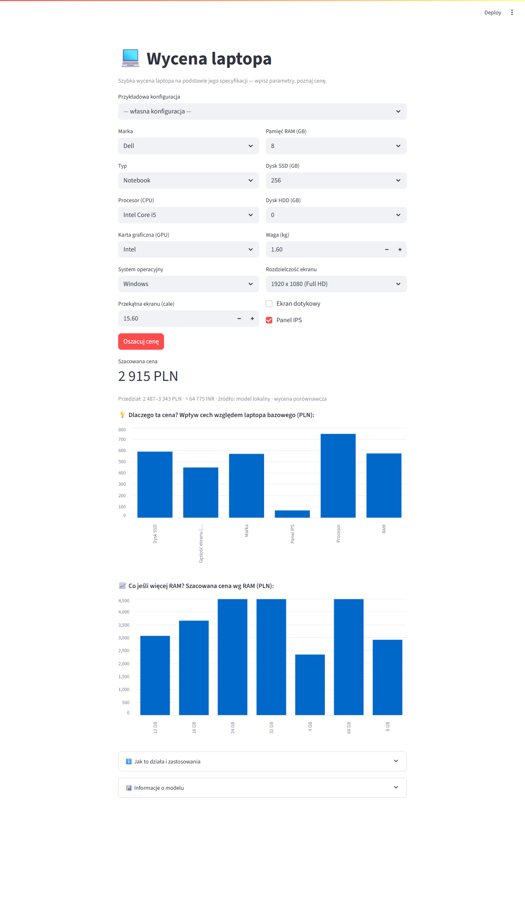

# Food Delivery ETA — Delivery Time Prediction

Predicts estimated delivery time (in minutes) for food-delivery orders from
order / route / context features. Trained with **AutoML (FLAML)**, served as a
**FastAPI** REST API with a **Streamlit** UI, and fully **containerized** with
Docker Compose. Clean `data | model | app` separation, driven by a single
`config.yaml`.

> Course: Środowiska uruchomieniowe ML (SUML), PJATK — group project.

## Business context

Delivery platforms (Wolt / Glovo / Uber Eats style) need an accurate ETA at order
time to set customer expectations, dispatch couriers, and flag orders at risk of
being late. This project trains a regression model that estimates delivery time
from distance, weather, traffic, preparation time, and courier experience, and
exposes it through a `/predict` endpoint. Baseline: **MAE ≈ 6.1 min, R² ≈ 0.82**.

## Architecture

Three independent packages, communicating through a saved artifact and HTTP:

- **data/** — load the real CSV (or generate synthetic data with the same schema),
  validate it, split, and build the preprocessing transformer.
- **model/** — train via AutoML (FLAML), evaluate, and persist one artifact
  (`model.joblib`, a full scikit-learn `Pipeline`) plus `metrics.json`.
- **app/** — FastAPI service that loads the artifact and serves `/predict`,
  `/health`, `/model-info`; a Streamlit UI calls the API (with a standalone fallback
  that loads the model directly when no API is reachable).

Everything is driven by `config.yaml`, so swapping the dataset or retuning AutoML
is a **config change, not a code change**.

## Repo structure

```
SUML-project/
├── config.yaml              # single source of truth: data + model + serving
├── requirements.txt         # pinned runtime deps (installed in the image)
├── requirements-dev.txt     # + pytest, pylint, black, isort, httpx, matplotlib
├── Dockerfile               # slim, non-root, trains the model at build time
├── docker-compose.yml       # services: api (FastAPI) + ui (Streamlit)
├── Makefile                 # train / api / ui / test / lint / format / docker
├── .pylintrc                # tuned to keep pylint >= 8
├── .github/workflows/ci.yml # CI: pylint (>= 8) + pytest
├── config.py                # typed, validated config loader (Pydantic)
├── data/
│   ├── raw/Food_Delivery_Times.csv   # dataset (tracked)
│   ├── synthetic.py         # deterministic synthetic generator (same schema)
│   ├── load.py              # load real CSV or synthetic + validate schema
│   └── prepare.py           # split + ColumnTransformer (impute + one-hot)
├── model/
│   ├── train.py             # FLAML fit -> model.joblib + metrics.json
│   ├── evaluate.py          # MAE / RMSE / R2
│   └── artifacts/           # model.joblib + metrics.json (git-ignored)
├── app/
│   ├── schemas.py           # Pydantic request/response models
│   ├── api.py               # FastAPI: /predict, /health, /model-info
│   └── ui.py                # Streamlit front, calls the API
├── tests/                   # pytest: data, model, schemas, api, ui
└── docs/                    # data card, EDA, design spec, plan
```

## Requirements

- Python 3.11+
- Docker + Docker Compose (for the containerized path)

Dependencies are pinned in `requirements.txt` and installed at image build —
**no host-level configuration required**.

## Quickstart (Docker) — one command

```bash
git clone https://github.com/nimzoi/SUML-project.git
cd SUML-project
docker compose up --build
```

- API: http://localhost:8000 — interactive docs at `/docs`
- UI:  http://localhost:8501

The dataset is committed and the model is trained during the image build, so this
runs end-to-end on real data with no manual steps.



## Run natively (without Docker)

```bash
python -m pip install -r requirements-dev.txt
python -m model.train      # writes model/artifacts/model.joblib + metrics.json
make api                   # or: uvicorn app.api:app --host 0.0.0.0 --port 8000
make ui                    # or: streamlit run app/ui.py
```

On Windows without `make`, use the explicit commands shown after each target.

## Configuration (`config.yaml`)

Single source of truth, validated on load. Key sections:

- `data` — dataset path, synthetic-generation toggle + size + seed, target,
  numeric/categorical feature lists, test split.
- `model` — AutoML task, `time_budget_s`, metric, `estimator_list`
  (`lgbm`, `rf`, `extra_tree`), `ensemble` (stacking), artifact paths, seed. **This is the AutoML config.**
- `api` / `ui` — host/port and the API URL the UI calls.

## Data

- Source: Kaggle `denkuznetz/food-delivery-time-prediction`, committed at
  `data/raw/Food_Delivery_Times.csv` (1000 × 9).
- If the CSV is absent, a deterministic synthetic dataset with the same schema is
  generated automatically. See [docs/data_card.md](docs/data_card.md).

## Retraining

Drop a new CSV with the same schema into `data/raw/` and run `python -m model.train`.
The loader validates the schema, and `model.joblib` + `metrics.json` are rebuilt — no
code changes. The app picks up the new artifact on restart.

## API

`POST /predict`

```json
{ "distance_km": 7.9, "weather": "Clear", "traffic_level": "Medium",
  "time_of_day": "Afternoon", "vehicle_type": "Scooter",
  "preparation_time_min": 12, "courier_experience_yrs": 2.0 }
```

→ `{ "eta_minutes": 44.6 }`  *(example value)*

- `GET /health` → `{ "status": "ok", "model_loaded": true }`
- `GET /model-info` → metrics + metadata (best estimator, training date, data source,
  feature importance)

Invalid input is rejected with HTTP 422 (validated by Pydantic); requests before a
model is trained return HTTP 503.

## Testing & quality

```bash
make test     # pytest
make lint     # pylint >= 8  (currently 10.00/10)
make format   # black + isort
```

CI (GitHub Actions) runs `pylint --fail-under=8` and `pytest` on every push and PR.

## Deploy to Streamlit Cloud

The Streamlit UI is **standalone-capable**: if no API is reachable it loads the model
directly (training it once on first run, cached), so the same `app/ui.py` runs on
[Streamlit Community Cloud](https://share.streamlit.io) with no separate API:

1. Make sure the repo is public (or authorize Streamlit for a private repo).
2. *New app* → repo `nimzoi/SUML-project`, branch `main`, main file `app/ui.py` → *Deploy*.
3. Python 3.11+. Dependencies come from `requirements.txt`; `packages.txt` installs
   `libgomp1` (needed by LightGBM). The model trains once on first load (~60s), then is cached.

## Docs

- Design spec: [docs/superpowers/specs/2026-06-04-food-delivery-eta-design.md](docs/superpowers/specs/2026-06-04-food-delivery-eta-design.md)
- Implementation plan: [docs/superpowers/plans/2026-06-04-food-delivery-eta.md](docs/superpowers/plans/2026-06-04-food-delivery-eta.md)
- Data card: [docs/data_card.md](docs/data_card.md)
```
