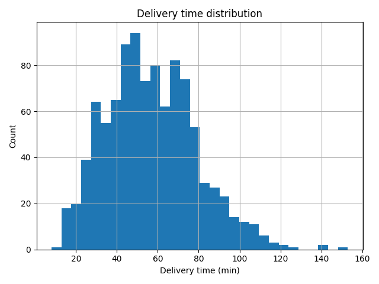
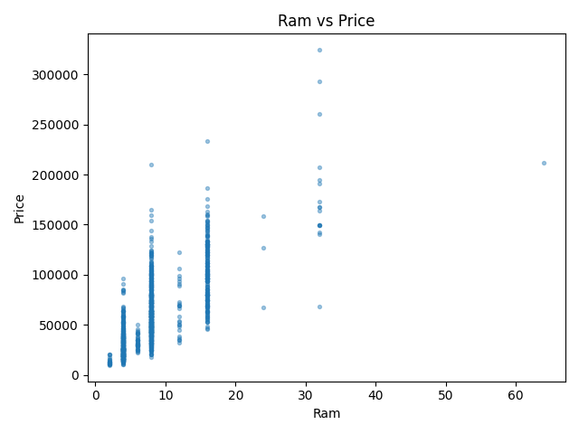

# Data card — ceny laptopów

## Źródło

- Dataset Kaggle z cenami laptopów (mirror campusx), zapisany w `data/raw/laptop_data.csv`.
- 1303 surowe rekordy i 12 kolumn; target: **Price** (waluta: INR, zgodnie ze zbiorem).
- Plik jest śledzony w repozytorium, żeby projekt dało się uruchomić bez pobierania danych.

Jeśli CSV nie istnieje, `data/synthetic.py` generuje deterministyczny zbiór o tym samym
schemacie cech modelowych. Dzięki temu pipeline może działać także bez realnego datasetu.

## Surowe dane → cechy modelowe

Surowy zbiór zawiera kilka pól zapisanych jako tekst. `data/features.py` parsuje je do
cech używanych przez model:

| Pole surowe | Cecha po przetworzeniu |
|---|---|
| `Ram` = `"8GB"` | `Ram` (int) |
| `Weight` = `"1.37kg"` | `Weight` (float) |
| `ScreenResolution` = `"IPS Panel ... 1920x1080"` | `Touchscreen` (0/1), `Ips` (0/1), `ppi` (float) |
| `Cpu` = `"Intel Core i5 7200U 2.5GHz"` | `Cpu_rank` (porządek: i3 < i5 < i7) |
| `Memory` = `"256GB SSD + 1TB HDD"` | `SSD` (GB), `HDD` (GB) |
| `Gpu` = `"Nvidia GeForce MX150"` | `Gpu_brand` (Intel/Nvidia/AMD) |
| `OpSys` | `Os` (Windows/Mac/Other) |

Warstwa czyszczenia usuwa kolumnę indeksu oraz rekordy z niepoprawnymi albo niemożliwymi
do sparsowania wartościami kluczowych cech. Braki komórkowe w dopuszczalnych kolumnach
są imputowane później w preprocessingu.

## Schemat po przetworzeniu

Target: `Price`

- **Cechy numeryczne:** `Ram`, `Weight`, `Inches`, `ppi`, `SSD`, `HDD`, `Touchscreen`,
  `Ips`, `Cpu_rank`
- **Cechy kategoryczne:** `Company`, `TypeName`, `Gpu_brand`, `Os`

## Rozkład targetu

## Wybrana cecha numeryczna względem ceny

## Baseline modelu

Model bazowy to FLAML AutoML z LightGBM, ograniczeniami monotonicznymi i log-transformacją
targetu. Na 20% holdoucie uzyskuje orientacyjnie **MAE ≈ 9 400**, **RMSE ≈ 14 700** i
**R² ≈ 0.85** na oryginalnej skali ceny (około 0.88 na skali logarytmicznej).

Najważniejsze cechy według permutation importance to zwykle RAM, SSD, typ laptopa i poziom
CPU. Aktualne wartości metryk są zapisywane w `model/artifacts/metrics.json` i dostępne
przez `GET /model-info`.
