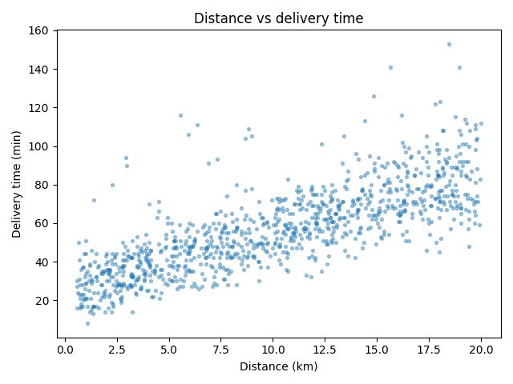

# Data Card — Food Delivery Times

## Source
- Kaggle: `denkuznetz/food-delivery-time-prediction`
- File: `data/raw/Food_Delivery_Times.csv` (committed to the repo for one-command reproducibility)
- 1000 rows × 9 columns; regression target = delivery time in minutes.

When the CSV is absent, `data/synthetic.py` deterministically generates a dataset with the
**same schema** (and ~3% injected nulls), so the pipeline runs anywhere without a manual download.

## Schema

| Column | Type | Role | Notes |
|--------|------|------|-------|
| Order_ID | int | id | dropped before training |
| Distance_km | float | numeric feature | ~0.5–20 |
| Weather | categorical | feature | Clear / Rainy / Snowy / Foggy / Windy |
| Traffic_Level | categorical | feature | Low / Medium / High |
| Time_of_Day | categorical | feature | Morning / Afternoon / Evening / Night |
| Vehicle_Type | categorical | feature | Bike / Scooter / Car |
| Preparation_Time_min | int | numeric feature | |
| Courier_Experience_yrs | float | numeric feature | |
| Delivery_Time_min | int | **target** | min 8, mean ≈ 57, max 153 |

## Missing values
The real data contains **30 nulls each** in `Weather`, `Traffic_Level`, `Time_of_Day`, and
`Courier_Experience_yrs`. They are imputed in `data/prepare.py` (most-frequent for
categoricals, median for numerics) inside the model pipeline, so training and serving handle
them identically.

## Target distribution

## Distance vs delivery time

## Baseline model
FLAML AutoML (best estimator: **LightGBM**) on a 20% holdout:
**MAE ≈ 6.4 min · RMSE ≈ 9.3 · R² ≈ 0.81.** Top features: distance, preparation time, courier
experience, traffic level. Live values are written to `model/artifacts/metrics.json` after
training and served at `GET /model-info`.
